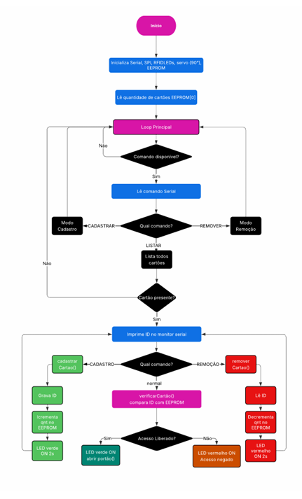
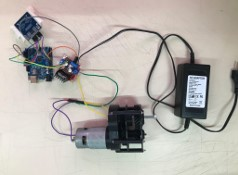

# Sistema de Controle de Acesso com RFID

## 📖 Descrição

Este projeto consiste em um sistema de controle de acesso utilizando tecnologia RFID e Arduino. O objetivo é permitir a abertura automática de uma porta ou portão por meio da aproximação de um cartão ou chaveiro RFID previamente cadastrado.

Quando uma tag autorizada é detectada, o sistema libera o acesso acionando um motor e sinaliza a autorização através de um LED verde. Caso a tag não esteja cadastrada, o acesso é negado e um LED vermelho é acionado.

O projeto foi desenvolvido com foco em acessibilidade, automação e segurança.

---

## 🎯 Objetivos

- Controlar o acesso de usuários autorizados.
- Automatizar a abertura e fechamento de portas.
- Utilizar RFID para identificação rápida e segura.
- Fornecer sinalização visual de acesso autorizado ou negado.
- Criar uma solução de baixo custo utilizando Arduino.

---

## ⚙️ Componentes Utilizados

- Arduino Uno
- Módulo RFID MFRC522
- Cartões/Tags RFID
- Ponte H L298N
- Motor DC 775
- LEDs (verde e vermelho)
- Resistores 220 Ω
- Fonte de alimentação
- Protoboard
- Jumpers
- Estrutura física da porta em MDF

---

## 🔌 Funcionamento

1. O usuário aproxima um cartão RFID do leitor.
2. O Arduino lê o UID da tag.
3. O sistema verifica se a tag está cadastrada.
4. Se autorizada:
   - Acende o LED verde.
   - Aciona o motor para abrir a porta.
   - Aguarda alguns segundos.
   - Fecha a porta automaticamente.
5. Se não autorizada:
   - Acende o LED vermelho.
   - O acesso é negado.

---

## 🛠️ Ligações

### RFID MFRC522

| RFID | Arduino |
|--------|--------|
| SDA | 10 |
| SCK | 13 |
| MOSI | 11 |
| MISO | 12 |
| RST | 9 |
| 3.3V | 3.3V |
| GND | GND |

### LEDs

| Componente | Pino |
|-----------|------|
| LED Verde | 2 |
| LED Vermelho | 8 |

### Ponte H L298N

| L298N | Arduino |
|--------|--------|
| IN3 | 3 |
| IN4 | 4 |
| GND | GND |

## 📷 Imagens

### FLUXOGRAMA

### Montagem

---

## 👥 Equipe

- Lucas Hudson
- Lucas Sebastião 
- Rosalvo Alves

---

## 📄 Licença

Projeto desenvolvido para fins acadêmicos e educacionais.

---

## ⭐ Resultado

O sistema permite controlar o acesso de forma automática utilizando RFID, oferecendo uma solução acessível, segura e de baixo custo para automação de portas e portões.
